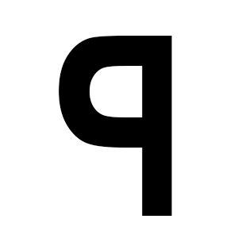
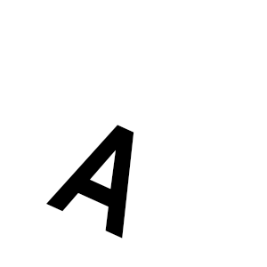
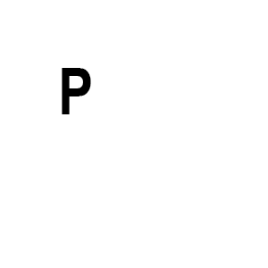
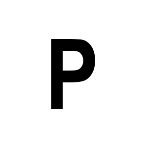
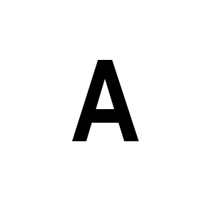
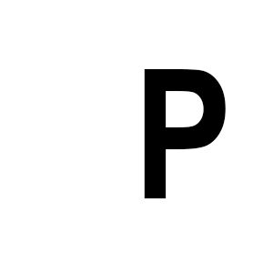
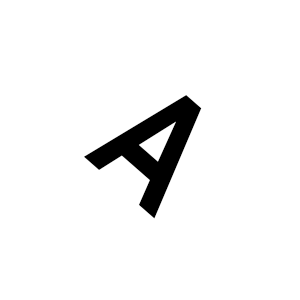
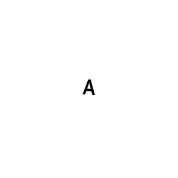
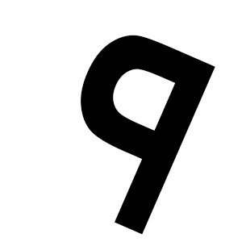

## Team Members
<ul>
<li>Riyan Bagas Dwi Prasetyo (K3521063)</li>
<li>Rizky Akbar Wahyu Putranto(K3521064)</li>
<li>Viola Clara Citra(K3521067)</li> 
<li>Zahra Khalila Salsabila (K3521069)</li>
<li>Lina Nurullaili(K3521039)</li>
<li>Zefanya Andin Novrean (K3521070)</li>
</ul>

## Hu Moments and Image Processing Results
## Hasil analisa:
Beberapa gambar dari dataset yang sama memiliki Hu Moments yang sangat mirip. Contohnya, "PData.png" dan "PData1.png" memiliki Hu Moments yang identik.
Dataset lain juga menunjukkan pola yang konsisten meskipun ada beberapa variasi kecil. Misalnya, AData.png, AData1.png, AData2.png, AData3.png, dan AData4.png memiliki nilai Hu Moments pertama (moment ke-1) yang sangat dekat sekitar 1.12e-03 hingga 1.13e-03.

Dataset "PData" dan "AData" menunjukkan perbedaan yang signifikan dalam beberapa momen. Sebagai contoh, momen ketiga (Hu Moment ke-3) untuk "AData" berkisar sekitar 7.3e-10 sementara untuk "PData" berkisar sekitar 5.2e-10.

Dalam kelompok dataset yang sama, misalnya "AData" atau "PData", ada kemiripan yang tinggi dalam nilai Hu Moments. Ini menunjukkan bahwa gambar dalam kelompok yang sama memiliki struktur atau bentuk yang serupa.

Hu Moments for PData3.png:
[ 1.17654166e-03  2.58635936e-07  5.13066593e-10  6.07798809e-11
  1.05967915e-20  3.06909726e-14 -1.70535064e-21]

image for PData3.png:

Hu Moments for PData2.png:
[1.17502101e-03 2.60625831e-07 5.11950170e-10 6.12493524e-11
 1.07229337e-20 3.10840407e-14 1.62865320e-21]

Thresholded image for PData2.png:

Hu Moments for AData2.png:
[ 1.12457954e-03  1.27665773e-07  7.32858682e-10  2.25646044e-12
 -9.17405397e-23  8.06045366e-16 -1.87216978e-24]

Thresholded image for AData2.png:

Hu Moments for PData5.png:
[1.13635286e-03 2.47195173e-07 4.72995620e-10 6.05097468e-11
 1.01224318e-20 2.98183114e-14 1.52629639e-21]

Thresholded image for PData5.png:

Hu Moments for PData1.png:
[1.17846089e-03 2.59903048e-07 5.25181424e-10 6.71139358e-11
 1.25243698e-20 3.41035540e-14 1.37931063e-21]

Thresholded image for PData1.png:

Hu Moments for AData.png:
[ 1.12946074e-03  1.28996490e-07  7.32714179e-10  2.66588753e-12
 -1.17781901e-22  9.57442925e-16 -3.11129719e-24]

Thresholded image for AData.png:

Hu Moments for PData.png:
[1.17846089e-03 2.59903048e-07 5.25181424e-10 6.71139358e-11
 1.25243698e-20 3.41035540e-14 1.37931063e-21]

Thresholded image for PData.png:

Hu Moments for AData3.png:
[ 1.13111636e-03  1.29690044e-07  7.45532784e-10  2.22597503e-12
 -9.06626183e-23  8.00946047e-16  1.79970673e-24]

Thresholded image for AData3.png:

Hu Moments for AData1.png:
[ 1.12437731e-03  1.27664418e-07  7.30741282e-10  2.20687506e-12
 -8.86050922e-23  7.87824507e-16  1.80162755e-24]

Thresholded image for AData1.png:

Hu Moments for AData4.png:
[ 1.04897714e-03  1.01495474e-07  5.95342901e-10  1.69899304e-12
 -5.38772113e-23  5.41186144e-16 -4.11962685e-24]

Thresholded image for AData4.png:

Hu Moments for PData4.png:
[ 1.16859863e-03  2.54642390e-07  5.04259824e-10  6.02680262e-11
  1.04000385e-20  3.02686171e-14 -1.49181862e-21]

Thresholded image for PData4.png:

